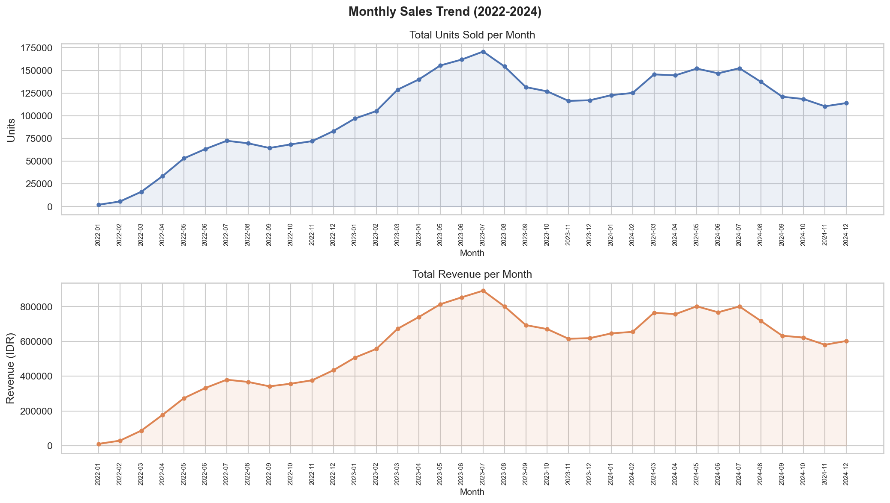
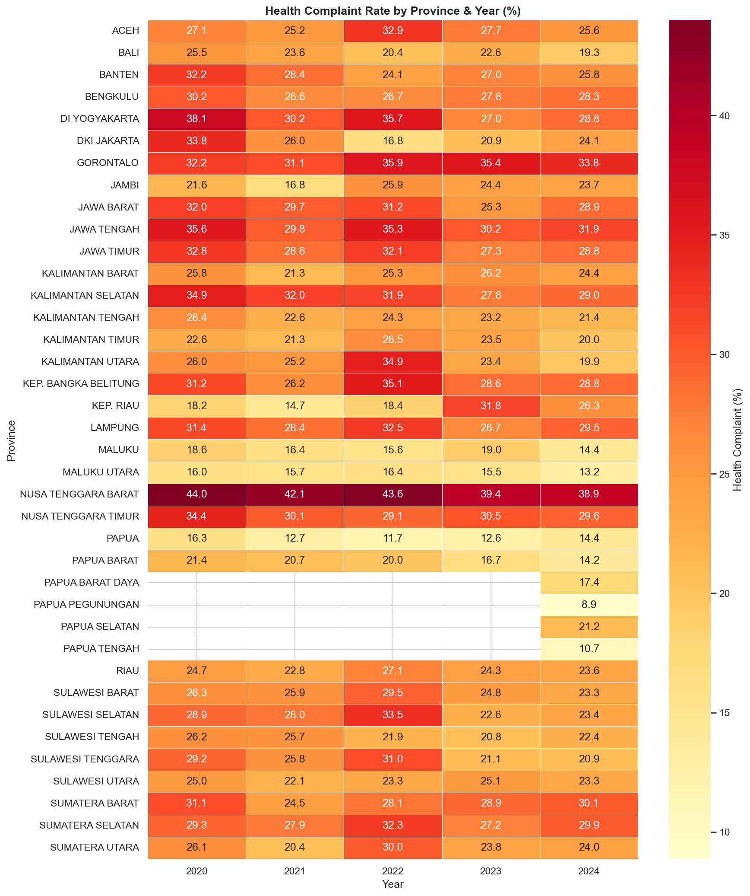

<p align="center">
  <h1 align="center">🏥 HealthStock Intelligence</h1>
  <p align="center">
    <strong>Predicting Consumer Health Demand for FMCG Distribution Optimization</strong>
  </p>
  <p align="center">
    
    
    
    
    
  </p>
</p>

> **Role:** Data Analyst & Data Scientist — Supply Chain & Commercial Analytics  
> **Domain:** FMCG × Public Health × Supply Chain Analytics  
> **Stack:** Python · SQL (PostgreSQL) · Power BI · Prophet · Scikit-learn

---

## 🚨 The Problem

Unilever Indonesia spends billions on logistics — yet hygiene and nutrition products (soap, vitamins, sanitizers) consistently run out in the regions that need them most. The current distribution model is **reactive**: restocking only happens after stockout. Meanwhile, public health data reveals predictable disease outbreak patterns that directly drive demand spikes.

**The result:** Lost revenue, missed public health impact, and an inefficient supply chain that doesn't respond to demand signals until it's too late.

---

## 💡 The Solution

**HealthStock Intelligence** is an end-to-end data pipeline that integrates **FMCG sales data** with **regional public health data (BPS Indonesia)** to answer three critical business questions:

| # | Business Question | Output |
|:-:|---|---|
| 1 | Which regions have the largest gap between health risk and product availability? | **Priority Zone Map** |
| 2 | How much potential revenue is lost due to stockouts in high-risk areas? | **Revenue Gap Report** |
| 3 | What is the optimal stock requirement per region for the next 3 months? | **Demand Forecast** |

---

## 📊 Key Results

| Metric | Result |
|---|---|
| 🔴 **Priority Zones** | **2 regions** identified as High Risk – Low Stock (Critical Gap) |
| 📈 **Forecast Accuracy** | **5.78% – 8.89% MAPE** across 3 regions using Facebook Prophet |
| 🧮 **Clustering** | **4 strategic quadrants** via K-Means: Critical Gap, Underserved, Well-Served, Surplus |
| 📦 **Revenue Gap** | Quantified per-region per-month potential lost revenue from stockout zones |

### K-Means Regional Segmentation

The clustering analysis segments all region-periods into 4 actionable quadrants based on **Health Risk Score vs Stock Availability**:

<p align="center">
  
</p>

| Cluster | Count | Priority | Action |
|---|:---:|:---:|---|
| 🔴 Critical Gap | 30 | 1 | Immediate stock increase required |
| 🟠 Underserved | 24 | 2 | Monitor and gradually increase supply |
| 🟡 Well-Served | 30 | 3 | Maintain current allocation |
| 🟢 Surplus | 24 | 4 | Potential for stock reallocation |

### Demand Forecasting (Facebook Prophet)

3-month demand forecast per region with confidence intervals:

<p align="center">
  
</p>

| Region | MAPE | Rating |
|---|:---:|---|
| PL-Central | 8.55% | ✅ < 15% target |
| PL-North | 8.89% | ✅ < 15% target |
| PL-South | 5.78% | ✅ < 15% target |

### Revenue Gap Analysis

<p align="center">
  
</p>

---

## 🔄 Project Phases

```
Phase 1: Business Understanding        ✅ Complete
Phase 2: Data Pre-processing           ✅ Complete
Phase 3: Data Warehouse (DWH)          ✅ Complete
Phase 4: Analysis & ML Modeling        ✅ Complete
Phase 5: Power BI Dashboard            ✅ Complete
```

---

## 🗂️ Project Structure

```
healthstock-intelligence/
│
├── 📁 data/
│   ├── raw/                           # Original datasets (FMCG, BPS, Calendar)
│   └── processed/                     # Cleaned data, results & visualizations
│
├── 📁 notebooks/
│   ├── 01_eda_fmcg.ipynb              # EDA — Sales & Demand Patterns
│   ├── 02_eda_health.ipynb            # EDA — Regional Health Incidence
│   ├── 03_preprocessing.ipynb         # Data Cleaning & Integration
│   ├── 04_dwh_etl.ipynb              # ETL Pipeline to PostgreSQL DWH
│   ├── 05_analysis_clustering.ipynb   # K-Means Segmentation & Correlation
│   └── 06_forecasting.ipynb           # Demand Forecasting with Prophet
│
├── 📁 sql/
│   ├── schema_dwh.sql                 # Snowflake Schema DDL
│   ├── etl_transform.sql              # ETL transformation queries
│   └── analysis_queires.sql           # Business insight queries
│
├── 📁 dashboard/
│   └── healthstock_dashboard.pbix     # Power BI Interactive Dashboard
│
├── 📁 docs/
│   ├── business_case.md               # Business Understanding & Problem Framing
│   ├── data_dictionary.md             # Field Definitions & Data Sources
│   └── methodology.md                 # Technical Approach & Decision Log
│
└── README.md
```

---

## 🧪 Analytical Highlights

### Exploratory Data Analysis

<p align="center">
  
</p>

<p align="center">
  
</p>

### Data Warehouse — Snowflake Schema

<p align="center">
  
</p>

### Correlation: Health Risk vs Sales Volume

<p align="center">
  
</p>

### Forecast Decomposition

<p align="center">
  
</p>

---

## 📦 Datasets

| Dataset | Source | Description |
|---|---|---|
| FMCG Sales & Demand | Kaggle | Product-level sales transactions by region (2022–2024) |
| Regional Disease Data | BPS (bps.go.id) | Incidence rates of ISPA, Diare, DBD, Pneumonia per province |
| Seasonal Calendar | BMKG / Custom | Rainy season, Ramadan, school holiday flags |

---

## 🛠️ Tech Stack

| Layer | Tools |
|---|---|
| Data Cleaning & EDA | Python (Pandas, NumPy, Matplotlib, Seaborn) |
| Machine Learning | Scikit-learn (K-Means), Facebook Prophet |
| Data Warehouse | PostgreSQL (Snowflake Schema) |
| Visualization | Power BI |
| Version Control | Git & GitHub |

---

## 🧠 Methodology Highlights

- **Health Risk Score (HRS):** Custom-engineered feature (0–100) — weighted sum of normalized BPS disease incidence data per province
- **K-Means Clustering:** Segments regions into 4 strategic quadrants (High/Low Risk × High/Low Stock) for actionable prioritization
- **Facebook Prophet:** Time-series forecasting with automatic seasonality detection (rainy season, Ramadan) for 3-month stock demand prediction
- **Revenue Gap Analysis:** `(Predicted Demand − Actual Stock) × Avg Selling Price` — quantifies lost opportunity in rupiah

> 📖 Full methodology & decision log: [docs/methodology.md](docs/methodology.md)

---

## 📬 Contact

**Dimas Rafi Izzulhaq**  
[LinkedIn](https://www.linkedin.com/in/dimas-rafi-izzulhaq-b94058378) · [Email](mailto:dimasizzulhaq35@gmail.com) · [GitHub](https://github.com/JullMol)

---

<p align="center">
  <em>End-to-end data analytics & data science capstone — from business understanding to predictive modeling & interactive dashboard.</em>
</p>