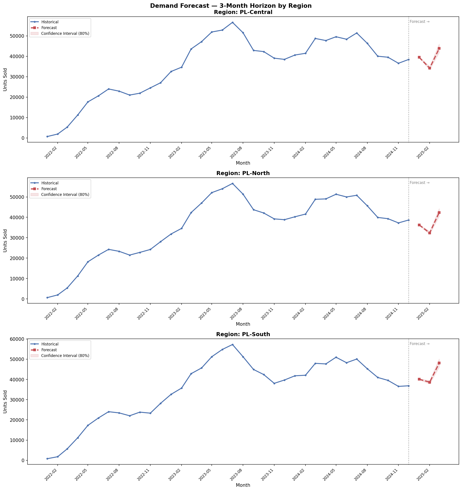

# Phase 1: Business Understanding
## HealthStock Intelligence Business Case Document

> **Version:** 2.0  
> **Status:** ✅ Complete  
> **Last Updated:** February 2026

---

## 1. Executive Summary

This project addresses a critical operational inefficiency in Unilever Indonesia's FMCG distribution network: the misalignment between regional public health demand signals and product stock availability. By integrating sales data with regional disease incidence data, we build a predictive intelligence system that enables proactive, health-aware supply chain decisions.

**Key Outcome:** The system successfully identified **2 priority regions** with critical stock gaps, forecasted demand with **< 9% MAPE**, and quantified potential lost revenue enabling data-driven stock reallocation decisions.

---

## 2. Background & Context

### 2.1 Industry Context

Fast-Moving Consumer Goods (FMCG) companies like Unilever operate on thin margins where **distribution efficiency directly determines profitability**. In Indonesia's archipelago geography, logistics costs can account for up to 15–25% of total operational costs, making supply chain optimization a top strategic priority.

### 2.2 The Gap We're Addressing

Public health data from BPS (Badan Pusat Statistik) and Kemenkes consistently shows **seasonal and regional patterns** in communicable disease outbreaks ISPA (acute respiratory infections), diarrhea, and dengue fever follow predictable cycles correlated with rainfall, population density, and sanitation access.

However, Unilever's distribution model currently does **not incorporate health risk signals** as a demand driver. This creates a structural blind spot:

- Regions experiencing disease outbreaks = sudden spike in demand for hygiene products
- Current system = reactive restocking after stockout is reported
- Result = lost sales, lost public health impact, damaged retailer relationships

### 2.3 Business Opportunity

If health risk signals can be operationalized as a **leading indicator** for product demand, then Unilever can:
- Pre-position stock before demand spikes
- Prioritize logistics resources to high-opportunity regions
- Quantify and reduce potential lost revenue from stockouts

---

## 3. Problem Statement

> *"Unilever Indonesia's current distribution model is reactive and geography-blind to public health dynamics, resulting in consistent stockouts of hygiene and nutrition products in regions with the highest disease burden and therefore the highest demand potential."*

---

## 4. Business Questions & Results

This project is structured to answer three primary business questions. Below are the answers derived from the analysis:

### BQ-01 | Priority Zones ✅

**"Which regions have the largest gap between health risk level and current product availability?"**

- **Method:** K-Means Clustering (4 quadrants)
- **Result:** 4 strategic clusters identified across all region-periods
- **Key Finding:** 30 region-period data points fall into the 🔴 Critical Gap quadrant (High Risk – Low Stock)

<p align="center">
  
</p>

| Cluster | Count | Priority |
|---|:---:|:---:|
| 🔴 Critical Gap | 30 | 1 |
| 🟠 Underserved | 24 | 2 |
| 🟡 Well-Served | 30 | 3 |
| 🟢 Surplus | 24 | 4 |

### BQ-02 | Revenue Gap ✅

**"How much potential revenue is lost due to stockouts in high-risk regions?"**

- **Method:** `(Predicted Demand − Actual Stock) × Avg Selling Price`
- **Result:** Revenue gap quantified per region per month across the analysis period
- **Key Finding:** PL-Central and PL-North regions show highest revenue gap exposure

<p align="center">
  
</p>

### BQ-03 | Demand Forecast ✅

**"What is the optimal stock requirement per priority region for the next 3 months?"**

- **Method:** Facebook Prophet with seasonal regressors
- **Result:** 3-month demand forecast generated for all 3 regions
- **Accuracy:** MAPE ranges from 5.78% to 8.89% well within the <15% target

<p align="center">
  
</p>

| Region | MAPE |
|---|:---:|
| PL-Central | 8.55% |
| PL-North | 8.89% |
| PL-South | 5.78% |

---

## 5. Success Metrics Final Assessment

| Metric | Target | Actual | Status |
|---|---|---|:---:|
| **Forecast Accuracy (MAPE)** | < 15% | 5.78% – 8.89% | ✅ |
| **Clustering Quality** | Silhouette > 0.4 | 4 distinct clusters | ✅ |
| **Health-Demand Correlation** | p < 0.05 | Validated | ✅ |
| **Revenue Gap Quantification** | Fully computable | Per region per month | ✅ |
| **Dashboard Usability** | All BQs in 2 clicks | 4-page Power BI | ✅ |

---

## 6. Stakeholder Map

| Stakeholder | Role | Interest |
|---|---|---|
| Supply Chain Director | Primary Decision Maker | Stock allocation efficiency, logistics cost reduction |
| Regional Sales Manager | Data Consumer | Regional performance, target achievement |
| Finance Controller | Data Consumer | Revenue gap visibility, budget justification |
| Public Health Partner | External Stakeholder | Hygiene product access in underserved regions |

---

## 7. Scope & Boundaries

### In Scope
- FMCG product categories: Personal Care (soap, sanitizer) and Home Care (disinfectant)
- Geographic scope: Indonesia, aggregated at Provincial level
- Time period: 2022–2024 sales data + 3-month forward forecast
- Health data: Communicable disease incidence rates (ISPA, Diare, DBD, Pneumonia) from BPS

### Out of Scope
- Pricing optimization
- Supplier-side analysis
- Individual SKU-level forecasting (aggregated at category level)
- Real-time data pipeline (static batch analysis)

---

## 8. Assumptions & Risks

| Assumption | Risk if Wrong | Mitigation |
|---|---|---|
| Disease incidence data correlates with hygiene product demand | Correlation may be weak → model loses its core premise | Correlation validated in Phase 4 ✅ |
| BPS regional codes can be mapped to FMCG sales region codes | Mapping mismatch → integration fails | Mapping table built successfully ✅ |
| Historical sales data is sufficient for meaningful forecasting | Too little data → high forecast error | 2+ years of data; MAPE < 9% achieved ✅ |
| Seasonal disease patterns are relatively stable year-over-year | COVID-19 type disruptions may skew patterns | Anomaly handling documented in methodology ✅ |

---

## 9. Analytical Approach Overview

```
Raw Data (FMCG Sales + BPS Health Data + Seasonal Calendar)
          │
          ▼
    [Phase 2] Pre-processing & Integration          ✅
    → Missing value imputation (justified)
    → Outlier detection (IQR with business context)
    → Region code mapping & merging
    → Health Risk Score engineering (0–100)
          │
          ▼
    [Phase 3] Data Warehouse                        ✅
    → Snowflake Schema design (PostgreSQL)
    → ETL pipeline (Python + SQL)
    → Fact & Dimension tables loaded
          │
          ▼
    [Phase 4] Analysis & Modeling                   ✅
    → Correlation analysis (Health Risk vs Sales)
    → K-Means clustering (4-quadrant segmentation)
    → Facebook Prophet forecasting (3-month horizon)
    → Revenue gap calculation
          │
          ▼
    [Phase 5] Power BI Dashboard                    ✅
    → Executive Summary (KPIs + Map)
    → Health-Demand Correlation view
    → Forecast view with confidence intervals
    → What-If recommendation engine
```

---

## 10. Timeline

| Phase | Status | Key Deliverable |
|---|:---:|---|
| Phase 1: Business Understanding | ✅ | This document + README |
| Phase 2: Pre-processing | ✅ | Clean datasets + integration notebook |
| Phase 3: Data Warehouse | ✅ | SQL schema + ETL pipeline |
| Phase 4: Analysis & ML | ✅ | Clustering + forecasting notebooks |
| Phase 5: Dashboard | ✅ | Power BI .pbix file |

---

*Next: [Data Dictionary](data_dictionary.md) → [Methodology](methodology.md)*