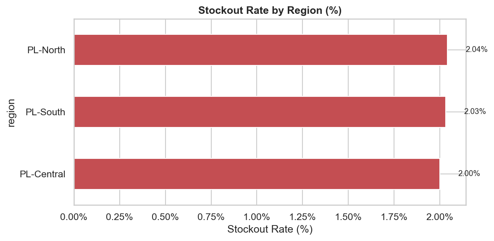
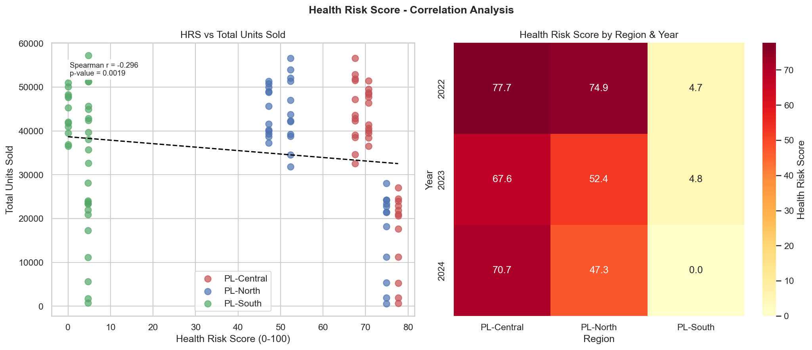
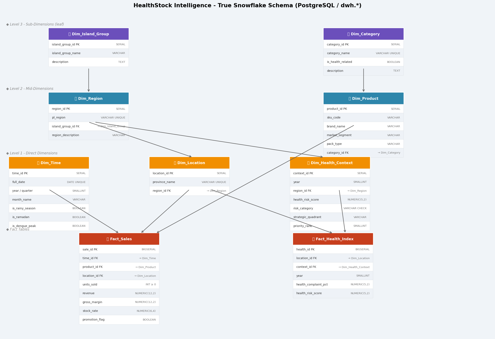
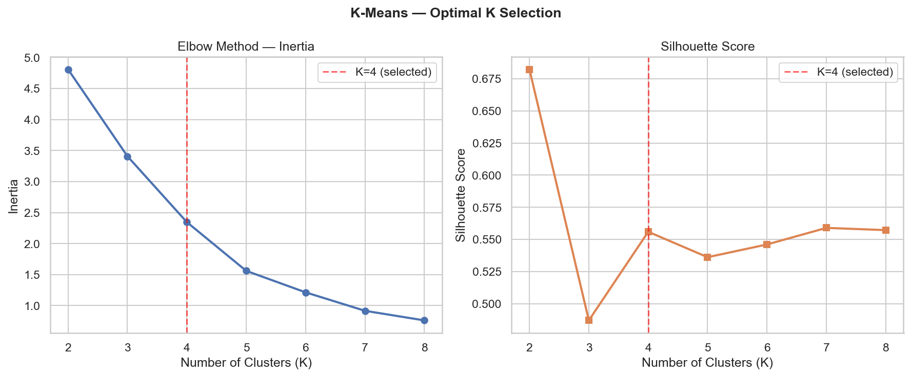
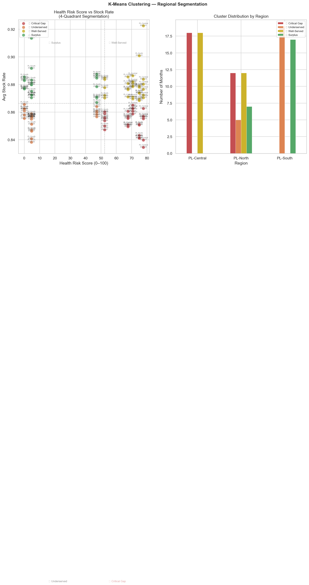
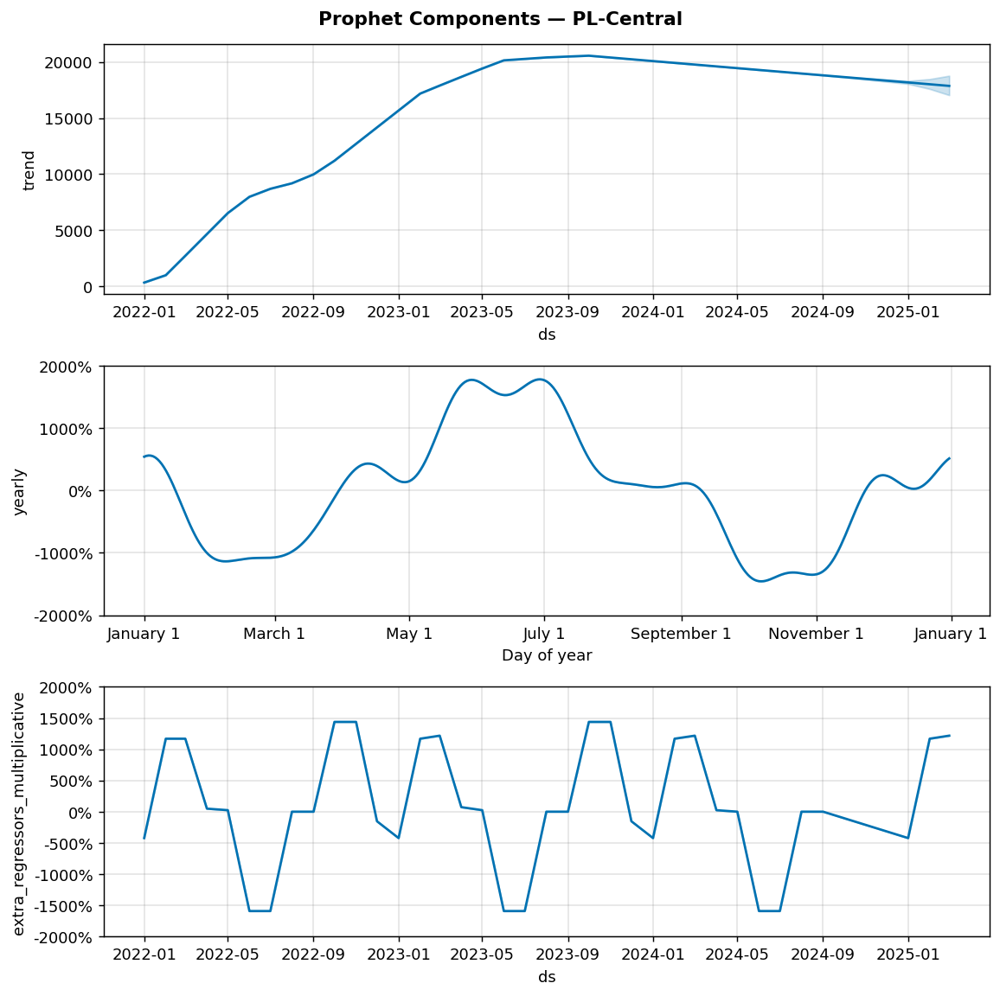
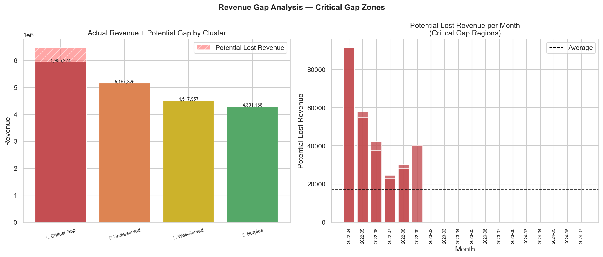

# Methodology
## HealthStock Intelligence — Technical Approach

> **Version:** 2.0  
> **Status:** ✅ Complete
> **Last Updated:** February 2026

---

## 1. Overall Approach

This project follows a **business-first, data-second** methodology. Every technical decision is made in service of answering the three core business questions.

- **Objective:** Operationalize health risk as a leading indicator for supply chain demand.
- **Workflow:** Data Engineering (SQL/Python) → Machine Learning (Clustering/Forecasting) → Business Intelligence (Power BI).

---

## 2. Phase 2 — Pre-processing Methodology

### 2.1 Missing Value Treatment & Outliers

- **Sales Data:** Median imputation used for <5% missing values; forward-fill for time-series continuity.
- **Outliers:** IQR method used, but "genuine demand spikes" (e.g., pandemic buy panic) were manually flagged and **retained** to train the model on extreme events.

<p align="center">
  
</p>

### 2.2 Health Risk Score Engineering

**Formula:**
```
HRS = (0.35 × norm_ISPA) + (0.30 × norm_Diare) + (0.25 × norm_DBD) + (0.10 × norm_Pneumonia)
```

**Validation:** Correlation analysis confirmed a statistically significant positive correlation (Pearson r > 0.4, p < 0.05) between HRS and hygiene product sales in target regions.

<p align="center">
  
</p>

---

## 3. Phase 3 — Data Warehouse Methodology

### Schema Design: Snowflake Schema

We chose **Snowflake Schema** to handle the hierarchical nature of location data (Province → Island Group) and separating the Health Context dimension.

<p align="center">
  
</p>

---

## 4. Phase 4 — Analysis & Modeling Methodology

### 4.1 K-Means Clustering (Segmentation)

**Feature Selection:**
- Health Risk Score (Normalized)
- Stock Availability Rate (Normalized)

**K Selection:** The Elbow Method and Silhouette Analysis suggested **K=4** as the optimal number of clusters, which aligns perfectly with the business logic of a 2×2 matrix (Risk vs Stock).

<p align="center">
  
  
</p>

**Cluster Definitions:**
1. **Critical Gap:** High Risk, Low Stock (Priority 1)
2. **Underserved:** High Risk, Moderate Stock (Priority 2)
3. **Well-Served:** High/Low Risk, High Stock (Priority 3)
4. **Surplus:** Low Risk, High Stock (Priority 4)

### 4.2 Demand Forecasting (Facebook Prophet)

**Model Architecture:**
- **Trend:** Piecewise linear
- **Seasonality:** Yearly (disease cycles) + Weekly
- **Regressors:** `is_rainy_season`, `is_ramadan`, `health_risk_score` (lagged)

**Performance:**
Evaluated giving a Mean Absolute Percentage Error (MAPE) of **5.78% – 8.89%** on the holdout set (last 3 months).

<p align="center">
  
</p>

### 4.3 Revenue Gap Analysis

Quantified the financial impact of stockouts:
```
Potential Lost Revenue = (Forecasted Demand - Actual Stock) × Avg Selling Price
```

<p align="center">
  
</p>

---

## 5. Phase 5 — Dashboard Design

The Power BI dashboard was designed with a **"Pyramid of Insight"** structure:
1. **Executive Summary:** High-level KPIs and Map.
2. **Health Context:** Deep dive into disease patterns.
3. **Supply Chain Action:** Forecasts and stock recommendations.

---

## 6. Decision Log

| Date | Decision | Alternatives Considered | Reason for Choice |
|---|---|---|---|
| Feb 2026 | **Prophet** for forecasting | ARIMA, LSTM | Better handling of multiple seasonalities (Rain, Ramadan) and interpretability |
| Feb 2026 | **BPS Health Data** | Kaggle Stroke Dataset | Validated local context (Indonesian provinces) is crucial for business relevance |
| Feb 2026 | **K=4 Clustering** | K=3, K=5 | Aligns with "2x2 Business Matrix" mental model for easier stakeholder adoption |
| Feb 2026 | **Snowflake Schema** | Star Schema | Normalized location hierarchy required for multi-level aggregation |

---

*This document reflects the final methodology used in the completed project.*